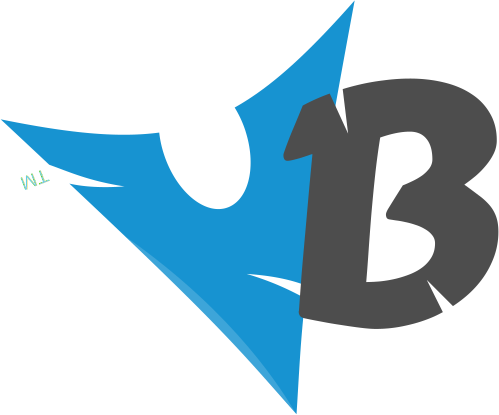

# 

I’m Valentin Brajon, a Developer and Entrepreneur from France who likes minimalism, sharp tools, web technologies and design. I work with Typescript, Tailwind and Vue. Formerly architect at [Theodo](https://theodo.com), founder of [100m.io](https://100m.io), now [Neoxam](https://neoxam.com).

## Projects
- [stimcraft.com](https://stimcraft.com/)
- [sound.link](https://sound.link/)
- [memory.limited](https://github.com/vbrajon/memory.limited) - [on Chrome](https://chrome.google.com/webstore/detail/memorylimited/pfhicfflehfdoocipahhhndmmcbepkmj)

## Websites
- [bio-d-or.com](https://bio-d-or.com)
- [hanasebel.com](https://hanasebel.com)
- [vbrajon.com](https://vbrajon.com)

## Tools
- [rawjs](https://vbrajon.github.io/rawjs/)
- [dotfiles](https://vbrajon.github.io/dotfiles/)
- [prettier-modify](https://vbrajon.github.io/prettier-modify/)

[Github](https://github.com/vbrajon) | [Twitter](https://twitter.com/vbrajon) | [LinkedIn](https://www.linkedin.com/in/vbrajon)

  

  

